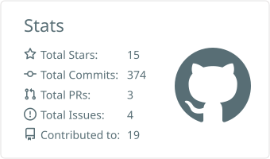
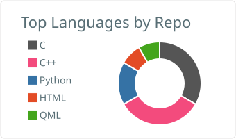
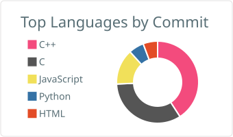

## Hi there 👋
I'm [COSMICAL-CONTAINER](https://cosmical-container.github.io/),a programme designer, and Postgraduate.I'm interested in development. I work on random projects in my free time.

我是[COSMICAL-CONTAINER](https://cosmical-container.github.io/)，一名程序员和研究生。我对开发很感兴趣。在空闲时间，我会参与各种随机项目。

  

  &emsp;
  &emsp;
  <!-- wakatime -->
  

  

    
    
  

  

    
    
  

Below are the platforms I commonly use

下面是我常用的平台

  

Below are the development tools I frequently use

下面是我常使用的开发工具

  
  
  

Below are the AI agents I frequently use

下面是我常使用的AI agent

  
  

And the language I often use

以及我常使用的语言

  

Besides, I can also play some

除此之外我还会玩一些

  

    
  

  

    
    
    
    
    
  

